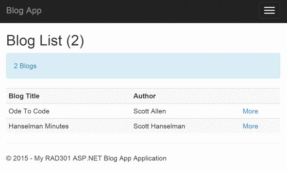

### Blog MVC Application for RAD301 (2015-16)

MVC App to work with Blogs & Posts. A number of branches (Stage*x*) add progressively to the objectives of the app. Checkout each branch to see the new features.

####Branch **Stage 6** (w/s 16-11-15)
####Branch **Stage 5** (w/s 9-11-15)
####Branch **Stage 4** (w/s 2-11-15)
####Branch **Stage 3** (w/s 26-10-15)
Mid-term Break - will front-load material via video recording for work over mid-term.

####Branch **Stage 2** (w/s 19-10-15)
Home page depicts a list of **Blogs** with some complementary data - e.g. number of posts presented in a CSS-enhanced layout. Clicking a **Blog** (either the row depicting the blog or via a button) leads to a **View** for each **Blog** revealing more details of the **Blog** such as a list of **Posts**s for that **Blog**. Links going in the reverse direction should also be coded. Again Bootstrap is used to improve presentation of this data.
**Models** are improved to provide an **Author** class with some attributes such as Name & Address (city will suffice).
Concepts covered:
* Data Annotations - to decorate fields for inclusion in **Views**
* Basic querying of POCO to populate **ViewModels**
* Bootstrap enhanced **Views**
* Some UI enhancements via jQuery/Bootstrap - perhaps integrated Google Map for **Author** city.

####**Stage 1** (w/s 12-10-15)

The Index action method of the Home Controller displays the list of Blogs. Clicking on each Blog displays details about that Blog (e.g. Title and Author).

Concepts examined:
* Role of Controller as 'director of operations' - routing.
* Preparation of **Views** either directly or through scaffolding
* Initial minor role of **Models** folder for **Blog** and **Post**
* Introduction of **ViewModels** folder to represent custom views of data in **Models**
* Preparation of data (artificially) in Controller for publishing through Views.