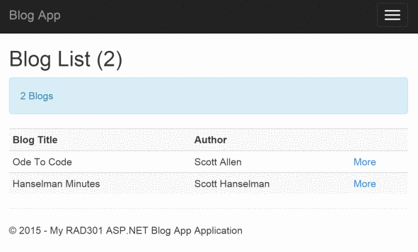

### Blog MVC Application for RAD301 (2015-16)

MVC App to work with Blogs & Posts. A number of branches (Stage*x*) add progressively to the objectives of the app. Checkout each branch to see the new features.

####**Stage 1** (w/s 12-10-15)

The Index action method of the Home Controller displays the list of Blogs. Clicking on each Blog displays details about that Blog (e.g. Title and Author).

Concepts examined:
* Role of Controller as 'director of operations' - routing.
* Preparation of **Views** either directly or through scaffolding
* Initial minor role of **Models** folder for **Blog** and **Post**
* Introduction of **ViewModels** folder to represent custom views of data in **Models**
* Preparation of data (artificially) in Controller for publishing through Views.